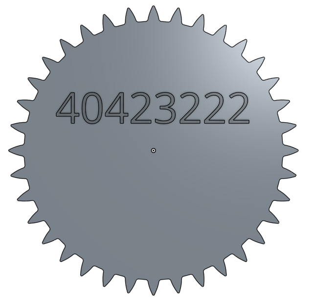

Title: 15W-Onshape gear
Date: 2017-05-31 09:18
Category: Course
Tags: notes, gear
Slug: 15W-Onshape gear
Author: 40423222

第15W上課任務

<!-- PELICAN_END_SUMMARY -->
### <a href="https://mde2a1.kmol.info/wiki?name=2017springcd">上課任務15W</a>

#### 個人還不會使用指令繪畫齒輪,所以使用Onshape來繪畫出齒輪

### 1. 繪畫出 半徑: 250 齒數: 36 壓力角: 20 的齒輪

#### 點擊下方圖片觀看齒輪

 
齒輪在Oshape任務一中展示

### 影片
<iframe src="https://player.vimeo.com/video/219620474" width="640" height="512" frameborder="0" webkitallowfullscreen mozallowfullscreen allowfullscreen></iframe>

<a href="https://vimeo.com/219620474">協同產品設計實習第十五週練習-1</a> from <a href="https://vimeo.com/user57795652">40423222</a> on <a href="https://vimeo.com">Vimeo</a>.

### 2. 繪畫出 半徑: 250 齒數: 36 壓力角: 20 的齒輪(只保留上半部)

#### 點擊下方圖片觀看齒輪

 
齒輪在Oshape任務二中展示

### 影片
<iframe src="https://player.vimeo.com/video/219619630" width="640" height="512" frameborder="0" webkitallowfullscreen mozallowfullscreen allowfullscreen></iframe>

<a href="https://vimeo.com/219619630">協同產品設計實習第十五週練習-2</a> from <a href="https://vimeo.com/user57795652">40423222</a> on <a href="https://vimeo.com">Vimeo</a>.
