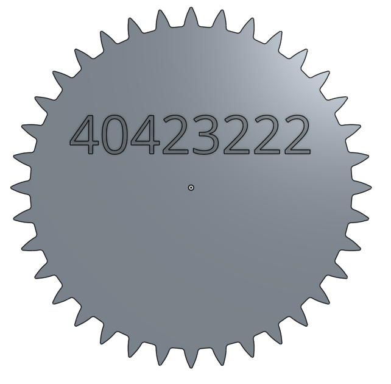

Title: 15W-gear
Date: 2017-05-31 09:18
Category: Course
Tags: notes, gear
Slug: 15W-gear
Author: 40423222

第15W上課任務

<!-- PELICAN_END_SUMMARY -->
### <a href="https://mde2a1.kmol.info/wiki?name=2017springcd">上課任務15W</a>

#### 個人還不會使用指令繪畫齒輪,所以使用Onshape來繪畫出齒輪

#### 點擊下方圖片觀看齒輪

#### 影片