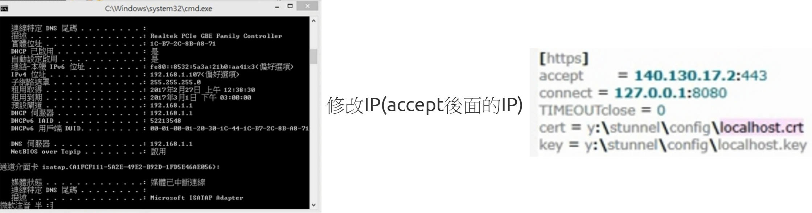
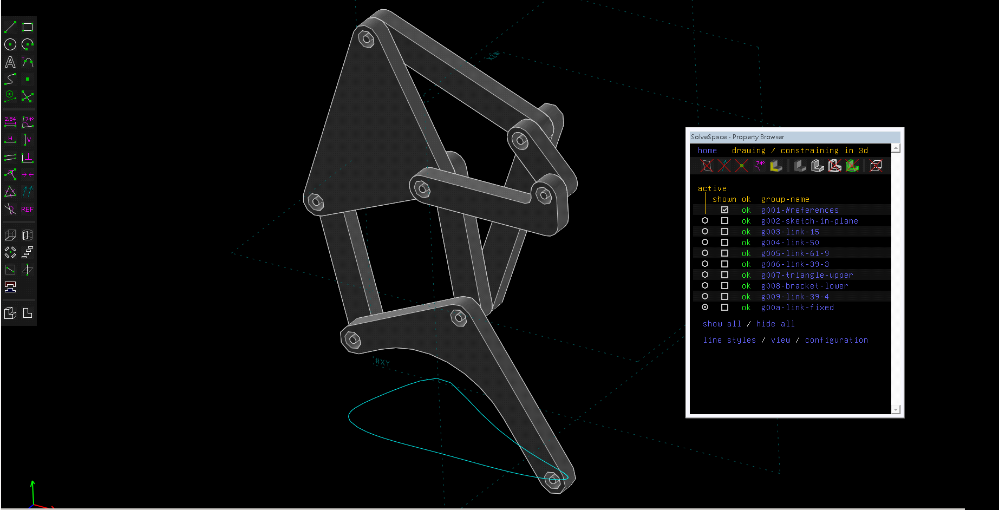
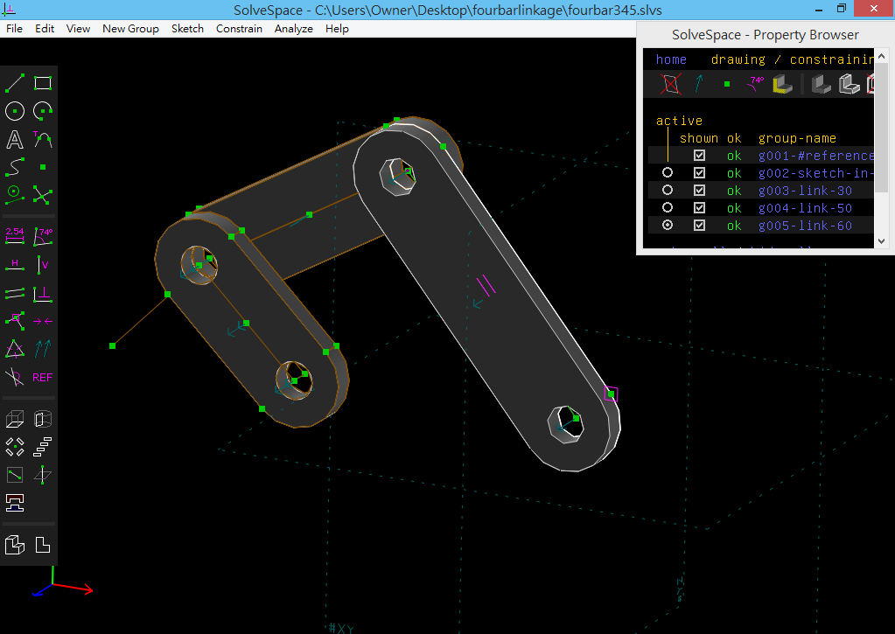
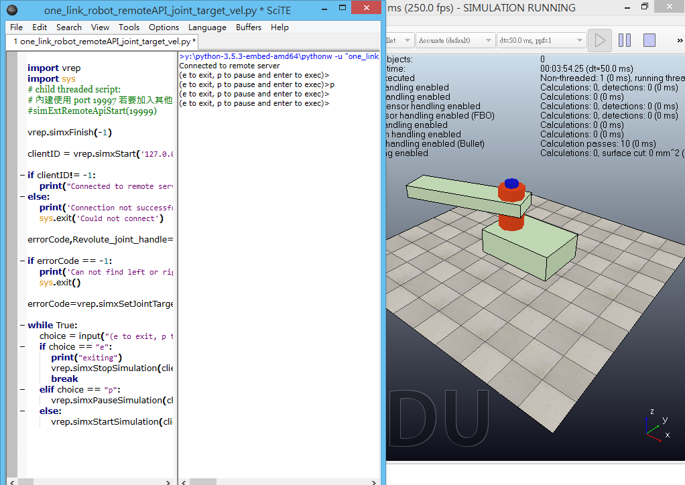

Title: 2017/02/22 第一週
Date: 2017-02-22 11:00
Category: Course
Tags: notes, w1
Slug: 2017spring-cd-W1
Author: 40423222

以下為bg7小組組長總合出的bg7_W1內容: 
學期的課程大綱 ; 了解如何使用stunnel ; 利用python程式碼控制Vrep ; 影片區

<!-- PELICAN_END_SUMMARY -->

## 學期的課程大綱:
可至<a href="http://mde.tw/2017springcd/blog/2017spring-cd.html">2017 Spring協同產品設計實習</a>觀看

 

## 了解如何使用stunnel:
在按下start之後,會出現錯誤的圖案,這是因為stunnel資料夾裡的config/styunnel.conf裡的ip與電腦的ip不同 
 
可至cmd打ipconfig/all的指令,找到電腦的ip位置並將其複製、利用Scite編輯貼到styunnel.conf裡 

 

## 利用python程式碼控制Vrep:

可至<a href="https://github.com/mdecourse/2017springcd">課程倉儲</a>的data裡下載fourbar_eightbar_solvespace_vrep.7z以及onelink_vrep_remoteapi_pos_vel.7z兩個檔案，解壓縮後會有三個檔案，分別是單連桿、四連桿及八連桿，可試著在solvespace及Vrep裡開啟。

在Vrep裡開啟one_link_robot_remoteAPI.ttt的檔案(ttt是Vrep檔案的副檔名)，在SciTE裡開啟one_link_robot_remoteAPI_joint_target_vel.py的檔案，按下Tool裡的Go即可開始控制單連桿，按Enter會旋轉，按P會暫停

 

## 影片區:

<iframe src="https://player.vimeo.com/video/206084321" width="640" height="360" frameborder="0" webkitallowfullscreen mozallowfullscreen allowfullscreen></iframe>

<a href="https://vimeo.com/206084321">stunnel設定</a> from <a href="https://vimeo.com/user47600730">40423228</a> on <a href="https://vimeo.com">Vimeo</a>.

 

<iframe src="https://player.vimeo.com/video/205656178" width="560" height="315" frameborder="0" webkitallowfullscreen mozallowfullscreen allowfullscreen></iframe>

<a href="https://vimeo.com/205656178">40423245機械設計工程系-協同產品設計實習課程-W1</a> from <a href="https://vimeo.com/user47996237">40423245</a> on <a href="https://vimeo.com">Vimeo</a>.

 

<iframe src="https://player.vimeo.com/video/209055449" width="640" height="360" frameborder="0" webkitallowfullscreen mozallowfullscreen allowfullscreen></iframe>

<a href="https://vimeo.com/209055449">2017CD 第一週</a> from <a href="https://vimeo.com/user46447136">40423248</a> on <a href="https://vimeo.com">Vimeo</a>.
