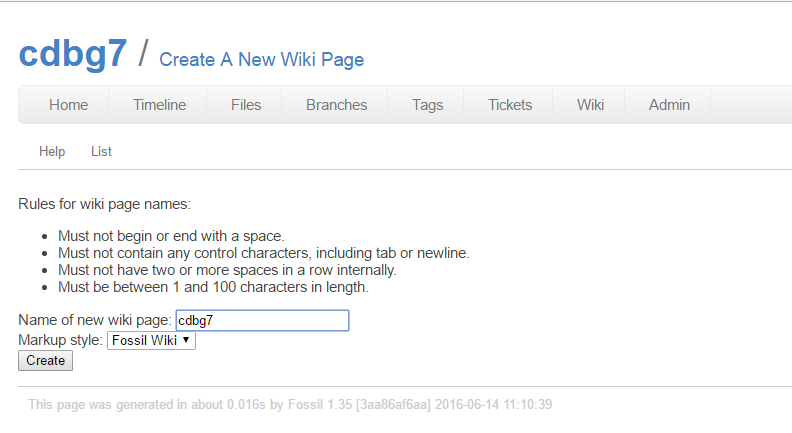

Title: 2017/03/22 第五週
Date: 2017-03-22 11:00
Category: Course
Tags: notes, w5
Slug: 2017spring-cd-W5
Author: 40423222

以下為bg7小組組長總合出的bg7_W5內容: 
在Fossil主頁上顯示筆記 ; V-rep模擬單連趕  ; 影片區

<!-- PELICAN_END_SUMMARY -->

## 在Fossil主頁上顯示筆記:
在wiki新增一個與倉儲同名稱的筆記，即可在fossil倉儲主頁上顯示這筆記內容
 
Note: 要是在Wiki上建立了,多餘的筆記,只要用修改,把內容全Delete,這筆記就會看不見 (但還是會有紀錄)

 

## V-rep模擬單連趕:
### 將上週的單連桿帶入V-rep模擬

 

### 接著利用Divide selected shapes將單連桿的零件分開

 

### 利用Add/Joint/Revolute新增一個旋轉軸

 

### 將旋轉軸的位置跟繪製的軸合併再一起

 

### 設置好各零件的從屬關係

 

### 接著設定旋轉軸的角速度，並固定單連桿

 

### 接著將桿子設為動態物件

 

## 影片區:
### 40423228
<iframe src="https://player.vimeo.com/video/212847283" width="640" height="512" frameborder="0" webkitallowfullscreen mozallowfullscreen allowfullscreen></iframe>

<a href="https://vimeo.com/212847283">20170322 單連桿vrep作動</a> from <a href="https://vimeo.com/user47600730">40423228</a> on <a href="https://vimeo.com">Vimeo</a>.

<iframe src="https://player.vimeo.com/video/212855650" width="640" height="512" frameborder="0" webkitallowfullscreen mozallowfullscreen allowfullscreen></iframe>

<a href="https://vimeo.com/212855650">0322 四連桿 part1</a> from <a href="https://vimeo.com/user47600730">40423228</a> on <a href="https://vimeo.com">Vimeo</a>.

<iframe src="https://player.vimeo.com/video/212855920" width="640" height="512" frameborder="0" webkitallowfullscreen mozallowfullscreen allowfullscreen></iframe>

<a href="https://vimeo.com/212855920">20170322 四連桿 part2</a> from <a href="https://vimeo.com/user47600730">40423228</a> on <a href="https://vimeo.com">Vimeo</a>.

 

### 40423245
<iframe src="https://player.vimeo.com/video/210093581" width="640" height="454" frameborder="0" webkitallowfullscreen mozallowfullscreen allowfullscreen></iframe>

<a href="https://vimeo.com/210093581">40423245機械設計工程系 - 協同產品設計實習課程-W5上課練習</a> from <a href="https://vimeo.com/user47996237">40423245</a> on <a href="https://vimeo.com">Vimeo</a>.

<iframe src="https://player.vimeo.com/video/210037771" width="640" height="454" frameborder="0" webkitallowfullscreen mozallowfullscreen allowfullscreen></iframe>

<a href="https://vimeo.com/210037771">40423245機械設計工程系 - 協同產品設計實習課程-W5回家練習</a> from <a href="https://vimeo.com/user47996237">40423245</a> on <a href="https://vimeo.com">Vimeo</a>.

 